# 🎬 BookMyShow Clone

A full-stack MERN application for movie ticket booking with role-based access, secure Stripe payments, and real-time seat selection.

🌐 **Live Demo**: [https://bms-client-nrh5.onrender.com](https://bms-client-nrh5.onrender.com)

---

## 🔧 Tech Stack

- **Frontend**: React.js, Redux Toolkit, Ant Design, Axios  
- **Backend**: Node.js, Express.js, MongoDB, Mongoose  
- **Authentication**: JWT  
- **Payments**: Stripe  
- **Deployment**: Render (Client + Server)

---

## ✨ Features

- 👤 User Authentication (Login/Register)
- 🔐 Role-based Access: Admin, Partner, User
- 🎞️ Movie & Theatre Management (Admin/Partner)
- 📅 Show Scheduling & Management
- 💺 Seat Selection + Stripe Payment
- 📜 Booking History
- 📩 Email Notifications (Ticket and OTP for reset password)

---

## 🚀 Local Setup

### 1. Clone the Repository

```bash
git clone https://github.com/sachinsirvi/BMS.git
cd BMS
```

### 2. Install Frontend Dependencies

```bash
cd client
npm install
```

### 3. Install Backend Dependencies

```bash
cd ../server
npm install
```

### 4. Configure Environment Variables

Create a `.env` file inside `server/`:

```
MONGO_URI=your_mongo_db_connection
JWT_SECRET=your_jwt_secret
PORT=8080
```

### 5. Run Locally

- **Client**: `npm start` inside `client/`
- **Server**: `npm run dev` inside `server/`

---

## 📸 Screenshots

### 🎟️ User Experience

- **Login Page**  
  

- **Register Page**  
  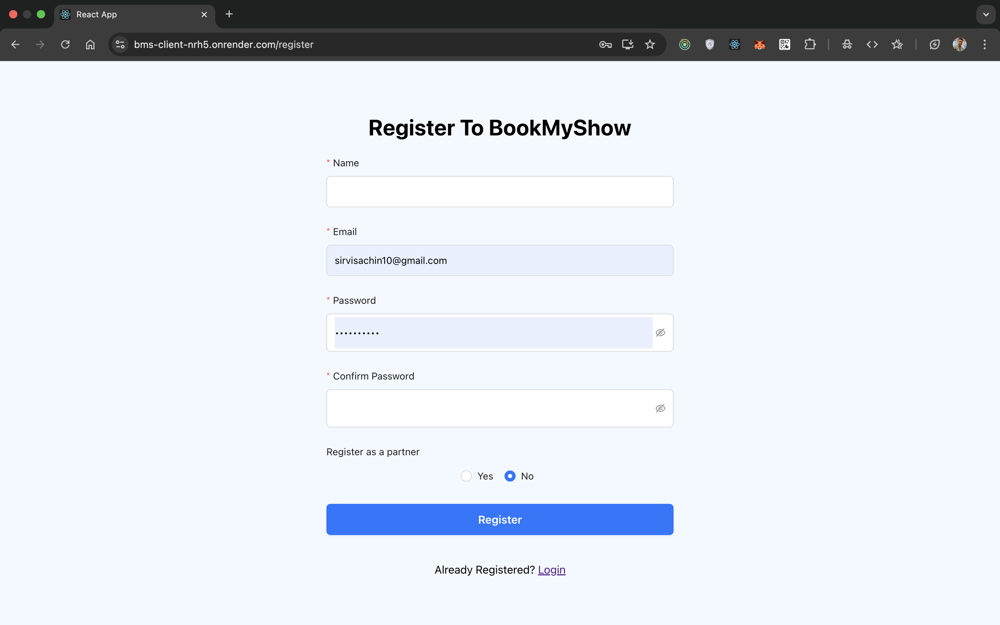

- **Home Page with Movie Listings**  
  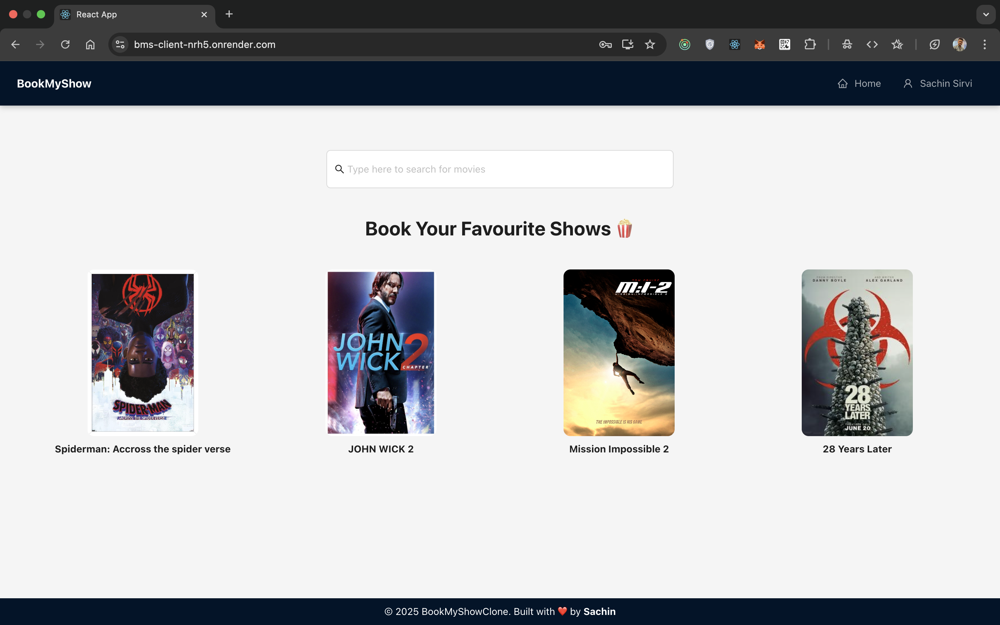

- **Movie Shows Page**  
  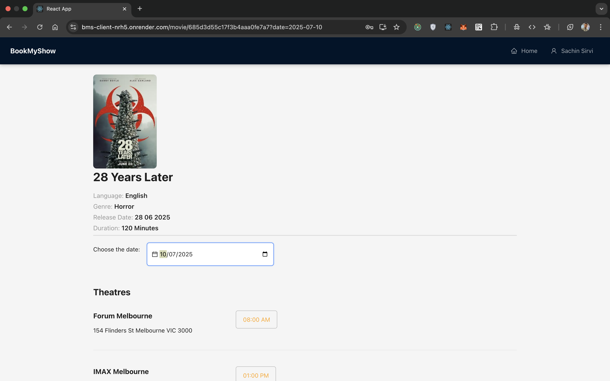

- **Seat Selection Page**  
  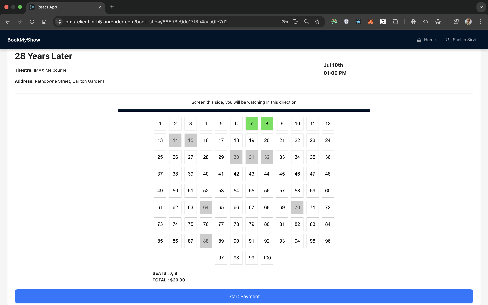

- **Stripe Payment Integration**  
  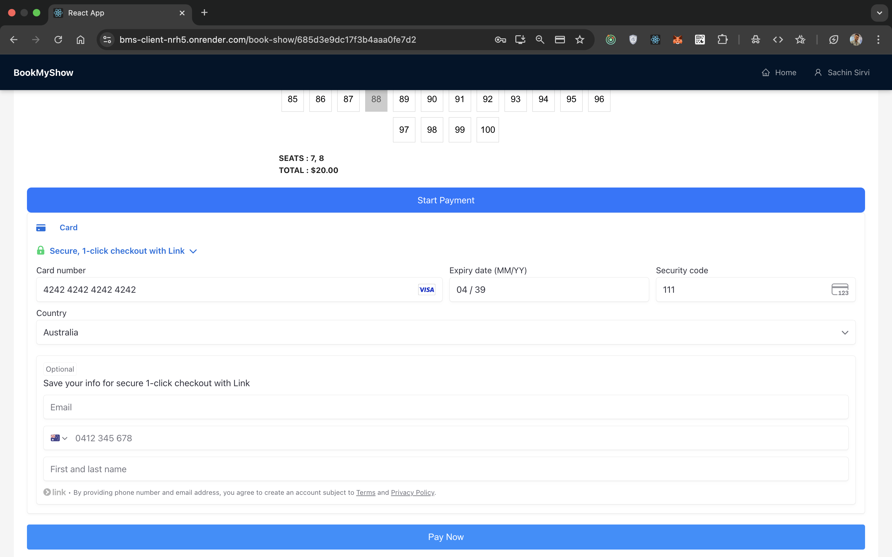

- **Profile Page with Booking History**  
  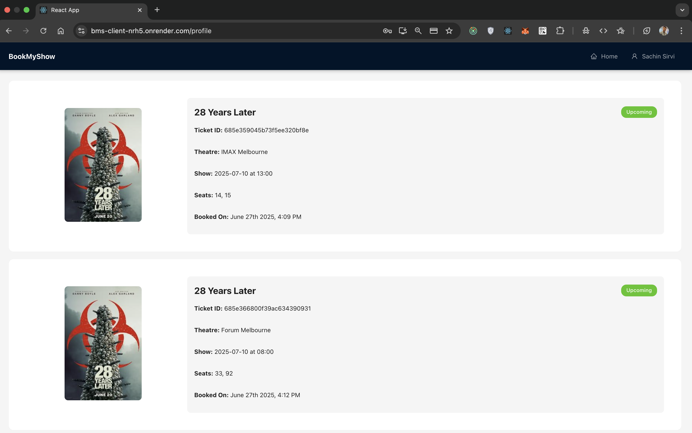

---

### 🛠️ Admin & Partner Views

- **Admin – Movie Management**  
  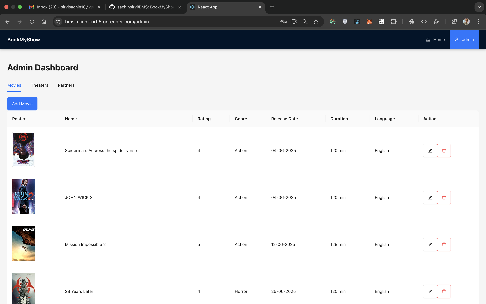

- **Admin – Partner Approval**  
  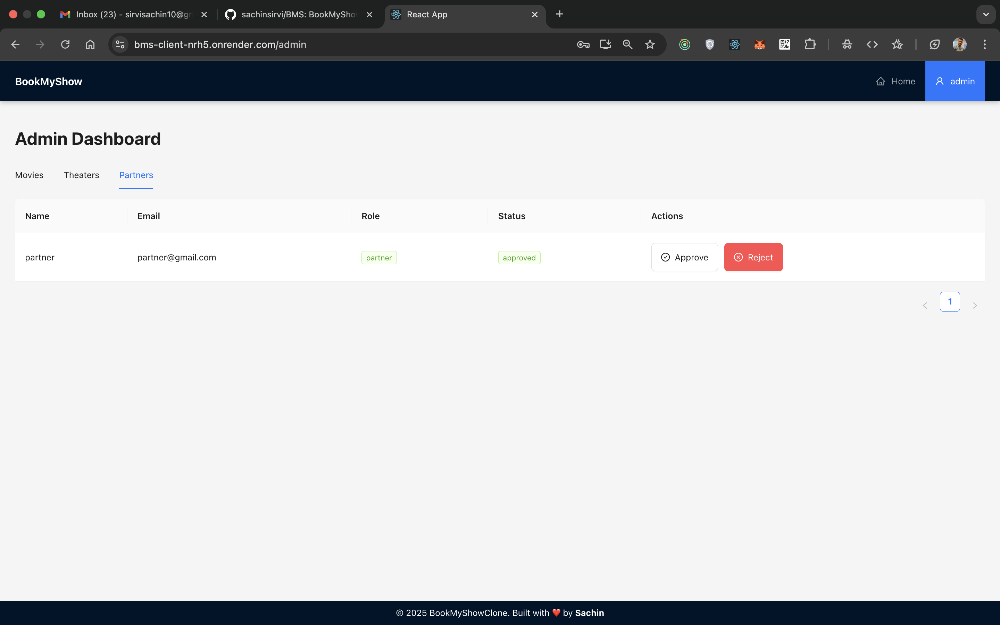

- **Admin – Theatre Listings**  
  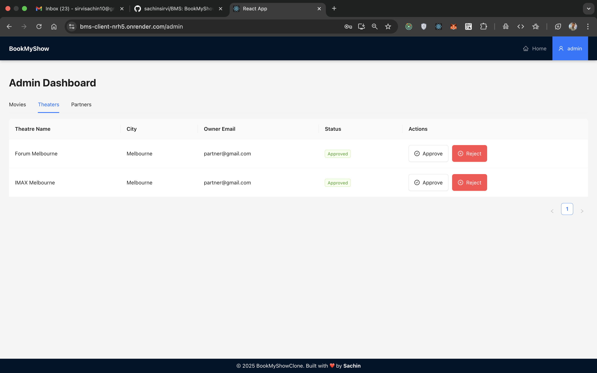

- **Partner – Theatre Management**  
  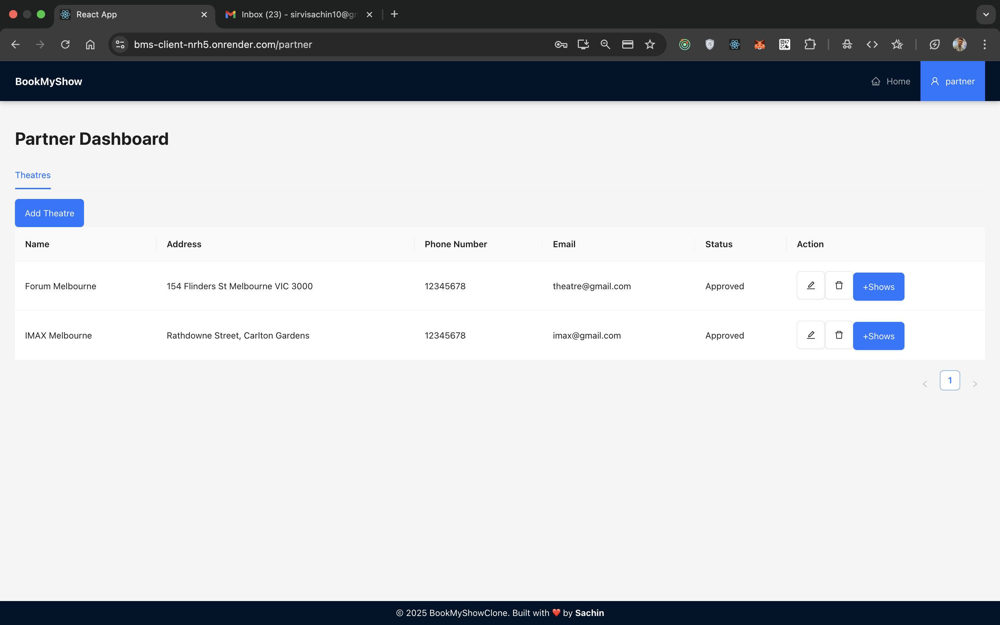

- **Partner – Show Scheduling**  
  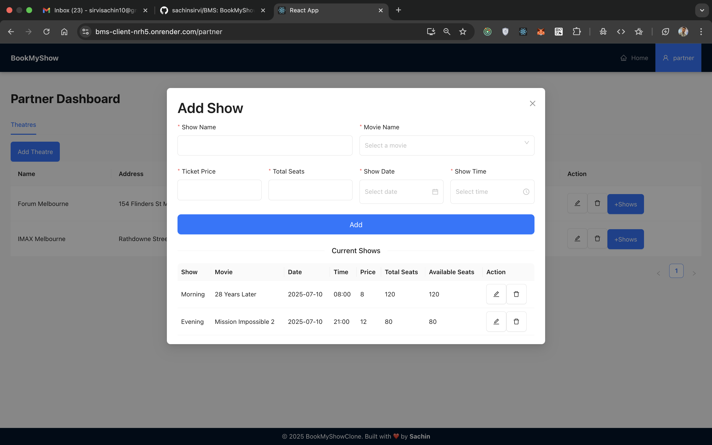

---

### ✉️ Email Notifications

- **OTP Email (Reset Password)**  
  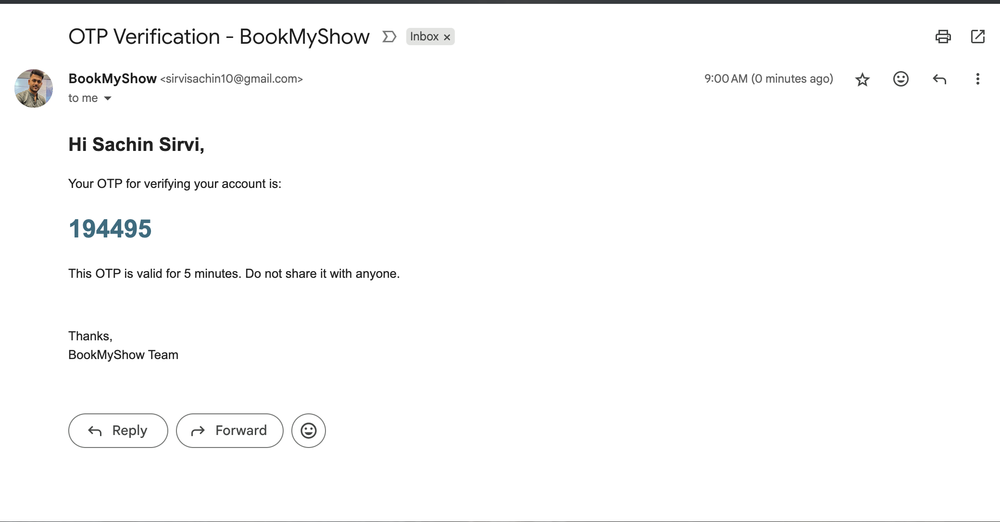

- **Booking Confirmation Email**  
  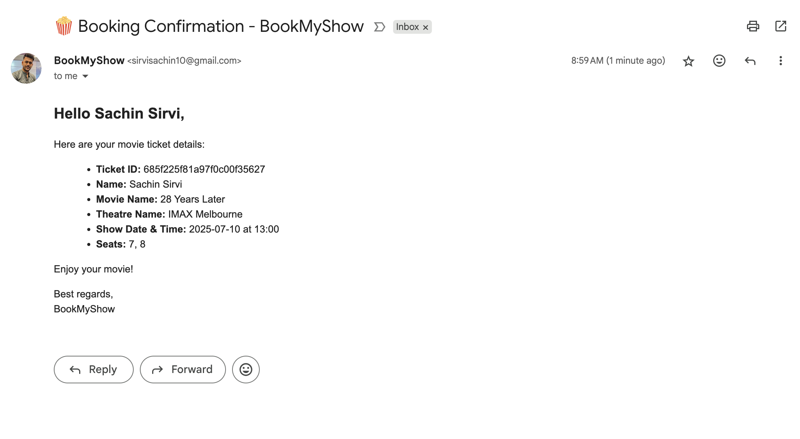

- **Forgot Password Page**  
  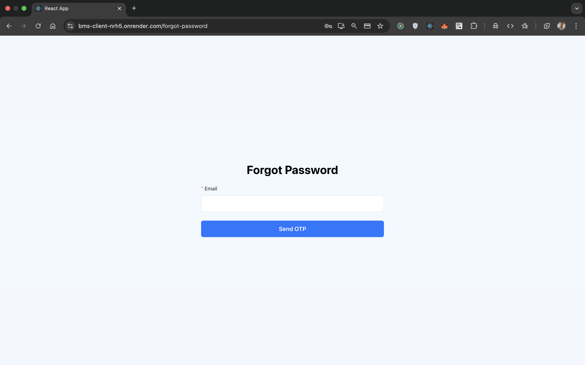

- **Reset Password Page**  
  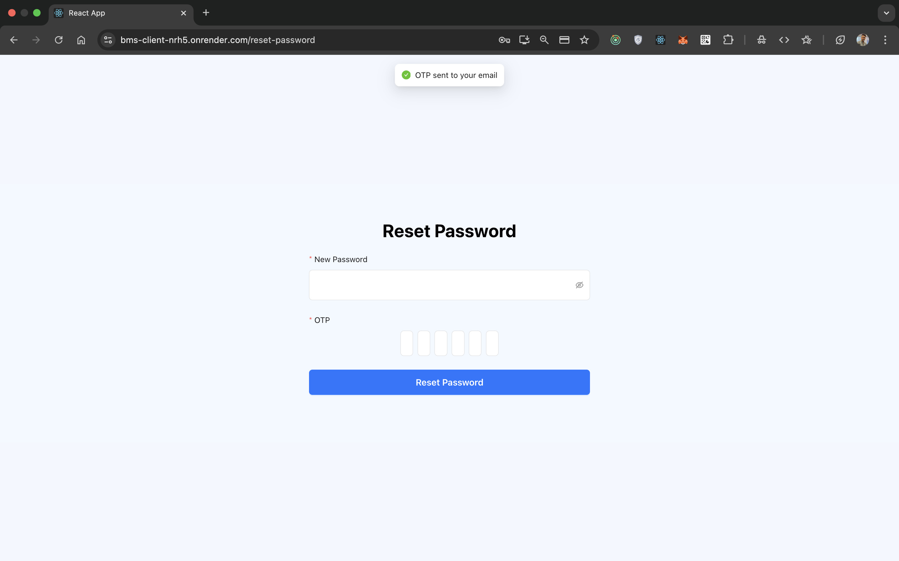


---
## 📬 Contact

**Sachin Sirvi**  
📧 sirvisachin10@gmail.com  
🌐 [LinkedIn](https://www.linkedin.com/in/sachin-sirvi/)
